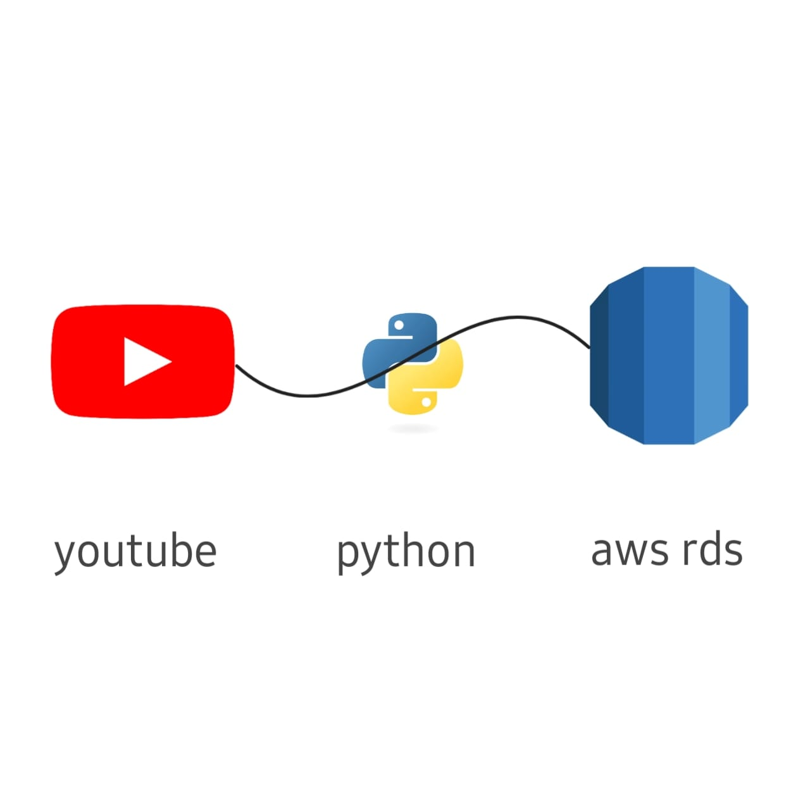

<h1 align="center">
   
  
   
  Markdownify
   
</h1>

  <a href="#Introduction">Key Features</a> •
  <a href="#Technologies Applied">Download</a> •
  <a href="#credits">Credits</a> •
  <a href="#license">License</a>

## Introduction 

It is a YouTube data harvesting and warehousing project. By providing the channel's ID, we can retrieve channel details and store them in an AWS RDS database for analysis.

## Technologies Applied
* virtual environment (.venv)
* python
* streamlit 
* Youtube Api 
* AWS RDS Database

## Credits

Nambu keerthi R
GitHub [@nambukeerthi](https://github.com/Nambukeerthi) &nbsp;&middot;&nbsp;

## License

MIT

---

